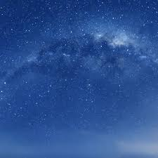

# Image-to-Square Java Application

## Overview

This is a Java application that converts rectangular images into square images by padding them with a specified color. It is designed to handle various image formats and resize them while maintaining their original dimensions and proportions within a square canvas.

## Usage

### Prerequisites

- Java 11 or higher installed.
- Gradle installed (or use the included Gradle wrapper).

### Steps

1. Clone the repository.
   ```bash
   git clone <repository-url>
   cd IMAGE-TO-SQUARE--JAVA
   ```
2. Place your images in the `images/input` folder.
3. Build and run the application:
   ```bash
   ./gradlew run
   ```
4. Check the `images/output` folder for the squared images.

## Example Results

Below are examples of input images and their corresponding squared outputs:

### Input Images





### Output Images


